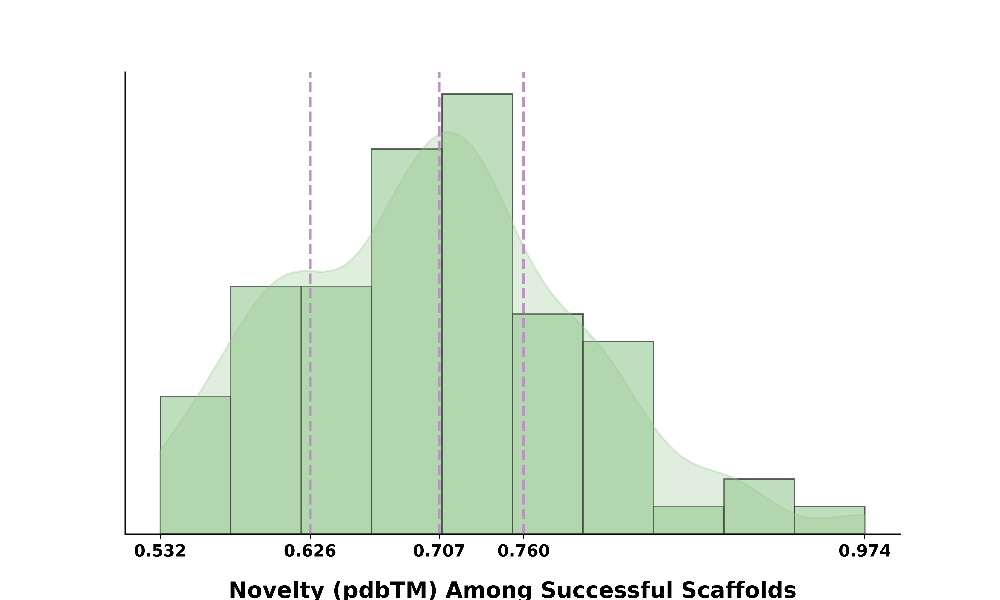
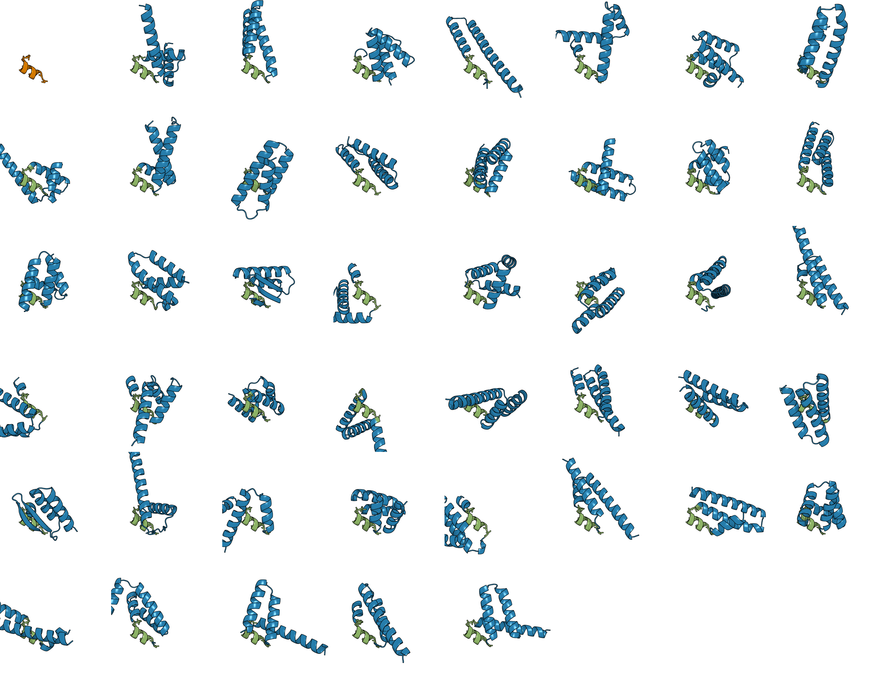

# Scaffold-Lab

[](https://www.biorxiv.org/content/10.1101/2024.02.10.579743v3)

Official implementation for [**_Scaffold-Lab: Critical Evaluation and Ranking of Protein Backbone Generation Methods in A Unified Framework_**](https://www.biorxiv.org/content/10.1101/2024.02.10.579743v3). 


## Description

**_Scaffold-Lab_** is the first unified framework for evaluating different protein backbone generation methods.  

We present the benchmark for both unconditional generation and conditional generation in terms of *designability*, *diversity*, *novelty*, *efficiency* and *structural properties*. Currently evaluated methods are listed below:

### Unconditional Generation

- *RFdiffusion*: [Paper](https://www.nature.com/articles/s41586-023-06415-8) | [Code](https://github.com/RosettaCommons/RFdiffusion)
- *Chroma*: [Paper](https://www.nature.com/articles/s41586-023-06728-8) | [Code](https://github.com/generatebio/chroma)
- *FrameDiff*: [Paper](https://openreview.net/forum?id=m8OUBymxwv) | [Code](https://github.com/jasonkyuyim/se3_diffusion)
- *FrameFlow*: [Paper](https://arxiv.org/abs/2310.05297) | [Code](https://github.com/microsoft/protein-frame-flow)
- *Genie*: [Paper](https://arxiv.org/abs/2301.12485) | [Code](https://github.com/aqlaboratory/genie)

### Conditional Generation

- *GPDL*: [Paper](https://www.biorxiv.org/content/10.1101/2023.10.26.564121v2) | [Code](https://github.com/sirius777coder/GPDL)
- *TDS*: [Paper](https://arxiv.org/abs/2306.17775) | [Code](https://github.com/blt2114/twisted_diffusion_sampler)
- *RFdiffusion*: [Paper](https://www.nature.com/articles/s41586-023-06415-8) | [Code](https://github.com/RosettaCommons/RFdiffusion)
- *Chroma*: [Paper](https://www.nature.com/articles/s41586-023-06728-8) | [Code](https://github.com/generatebio/chroma)

***

## Updates

* **_July 26th, 2024_**: A guideline for designing protein from scratch using different baseline methods is updated [here](https://github.com/Immortals-33/Scaffold-Lab/tree/main/baselines). We expect this as a reference for both reproduction and running methods benchmarked by our work with minimal efforts.
* **_July 19th, 2024_**: We now enable motif positions to be partially redesigned with ProteinMPNN. Check out [here](https://github.com/Immortals-33/Scaffold-Lab/blob/main/demo/motif_scaffolding/motif_info.csv) to see the way of specification.
* _**June 19th, 2024**_ : Scaffold-Lab now supports AlphaFold2 for evaluation! The implementation of AF2 is built upon [LocalColabFold](https://github.com/YoshitakaMo/localcolabfold). We refer interested users to [here](https://github.com/Immortals-33/Scaffold-Lab?tab=readme-ov-file#alphaFold2-single-chain-version) for more details. 

> [!NOTE]  
>
> You can also try our notebook in Colab. This is a **beta** version where bug reports and pull requests are especially welcomed. 
> 
> [](https://colab.research.google.com/github/Immortals-33/Scaffold-Lab/blob/main/scaffold_lab.ipynb)
>
***


## Table of Contents

* [Description](https://github.com/Immortals-33/Scaffold-Lab?tab=readme-ov-file#description)
* [Installation](https://github.com/Immortals-33/Scaffold-Lab?tab=readme-ov-file#installation)
* [Outline](https://github.com/Immortals-33/Scaffold-Lab?tab=readme-ov-file#outline)
* [Usage](https://github.com/Immortals-33/Scaffold-Lab?tab=readme-ov-file#usage)
  * [Unconditional Generation](https://github.com/Immortals-33/Scaffold-Lab?tab=readme-ov-file#unconditional-generation-1)
  * [Conditional Generation (Motif-scaffolding)](https://github.com/Immortals-33/Scaffold-Lab?tab=readme-ov-file#conditional-generation-motif-scaffolding)
  * [Customize Methods for Structure Prediction](https://github.com/Immortals-33/Scaffold-Lab?tab=readme-ov-file#customize-methods-for-structure-prediction)
    * [ESMFold](https://github.com/Immortals-33/Scaffold-Lab?tab=readme-ov-file#esmfold)
    * [AlphaFold2 (single-chain version)](https://github.com/Immortals-33/Scaffold-Lab?tab=readme-ov-file#alphafold2-single-chain-version)
* [Contact](https://github.com/Immortals-33/Scaffold-Lab?tab=readme-ov-file#contact)
* [Acknowledgements](https://github.com/Immortals-33/Scaffold-Lab?tab=readme-ov-file#acknowledgments)

***

## Installation

<details>
  <summary>Expand</summary>


We recommend using [Conda](https://anaconda.org/anaconda/conda) to set up dependencies. To quickly set up an environment, just simply run:

```bash
# Clone this repository and set up virtual environment
git clone https://github.com/Immortals-33/Scaffold-Lab.git
cd Scaffold-Lab
# Create and activate environment
conda env create -f scaffold_lab.yml
source activate scaffold_lab

# Install scaffold_lab as a package.
pip install -e .
```

You may also need to build a Foldseek database for diversity and novelty evaluation.

Within the conda environment, run:

```bash
mkdir <foldseek_pdb_database_path>
cd <foldseek_pdb_database_path>
foldseek databases PDB pdb tmp
```

After successfully building a PDB database of Foldseek, you can save the `<foldseek_pdb_database_path>` as a record and lately specify it your foldseek database path either using config or directly by command-line usage, whose demo is provided below. 

</details>

***

## Outline

<details>
    <summary>Expand</summary>


Here is a guide about how you can go through this repository. We aim to provide an easy-to-use evaluation pipeline as well as maximize the utility of individual scripts. Let's go through the structure of this repository as a start:

* `scaffold_lab`: This is the main directory to run different evaluations described in our paper.

* `analysis`: Scripts for calculating several metrics, including *diversity*, *novelty* and *structural properties*.  
* `baselines`: In order to generate protein backbones directly inside this repository, you may find the code of different methods baselines for [unconditional generation](https://github.com/Immortals-33/Scaffold-Lab#unconditional-generation) and [conditional generation](https://github.com/Immortals-33/Scaffold-Lab#unconditional-generation) then clone their repository under this content. it is highly recommended to run inference for different baselines **inside their own virtual environment** for potential conflicts of environmental dependencies.
  * Inside the `experiment` folder we provide scripts for performing motif-scaffolding experiments by *Chroma* using its `SubstrctureConditioner`. Refer the script for detailed information if you want.
* `config`: We place different configuration settings of [Hydra](https://github.com/facebookresearch/hydra) here to organize for evaluations. **Hydra** is a hierarchical configuration framework to help users systematize different experimental settings. Though it might be confusing when you first get in touch with it, it is a powerful tool to help you perform experiments efficiently with different combinations of parameters, for example, _the number of sequences to generate_. We recommend readers to [Docs](https://hydra.cc/docs/intro/) for advanced usage.

</details>

***


## Usage

<details>
    <summary>Expand</summary>

### Unconditional Generation

Let's start by running a simple evaluation here: 

```bash
python scaffold_lab/unconditional/refolding.py 
```

 This performs a simple refolding analysis for the proteins we put inside `demo/unconditional/`.

***

### Conditional Generation (Motif-scaffolding)


To run a minimal version on motif-scaffolding task, simply run:

```bash
python scaffold_lab/motif_scaffolding/motif_refolding.py evaluation.foldseek_database=<foldseek_pdb_database_path> # Specify the path of your Foldseek database directly
```

This performs a evaluation on `demo/motif_scaffolding/2KL8/` where the outputs would be saved under `outputs/2KL8/`.

#### Scaffold information file (`motif_info.csv`)

`motif_refolding.py` requires a metadata file, [motif_info.csv](https://github.com/Immortals-33/Scaffold-Lab/blob/main/demo/motif_scaffolding/motif_info.csv), with information relating generated scaffolds to the motif.
Within our grammar system, a complete contig includes **two** to **four** parts separated by a `,` (**comma**). For example, a row of this file is `0,2KL8,2,A1-7/20/A28-79,A3-5;A33;A36,A;B`. Separated by the commas are four parts:
This csv file has the following fields for each scaffold:
* **pdb_name** The reference PDB name.  This is for extracting reference motifs for calculation and identification. e.g. `2KL8` in this case.
* **sample_num** gives the sample id number for cases when there are multiple scaffolds to be evaluated.
* **_contig__** (motif placement) This part shows the information of where the motifs and scaffolds are placed. e.g. `A1-7/20/A28-79	` in this case.
  - The **motif** parts start with an uppercase letter and contain information about the corresponding **native motifs.** If the numbers are continuous, then separated by **hyphens**. The boundaries of motifs and scaffolds are separated by **slashes**.
  - The **scaffold** parts are single numbers, which is **deterministic** as the scaffold part of the uploaded PDB files are already placed during the design process. **The motif parts indicate residues in native PDBs but not scaffold PDBs. We choose this way because this would be convenient for users to locate which part the motifs are mimicking corresponding to the reference PDBs.**
  - Together, the motif placement part provides information about which parts are motifs (indicated by chain letter) and how they correspond to native ones, and the overall length of the designed scaffold. For example, `1A1-7/20/A28-79` means the scaffold parts contains:
    - First a motif segment containing residues 1-7 of chain A of **_2KL8_**;
    - Followed by a 20-residue segment of scaffold;
    - Finally a 52-residue motif segment of chain A of **_2KL8_**.
* **Redesigned positions:** This part indicates which positions to be redesigned in the **reference proteins**, e.g.`A3-5;A33;A36` in this case indicates residues 3, 4, 5, 33, and 36 of chain A in **_2KL8_**. Different redesigned positions are separated by **semi-colons**; if the positions are continuous, then connected by **hyphens**; always starts with an uppercase chain letter.
* **Segment order**: The order of multiple motif segments in backbones. This may be used when each of the motif segments its own chain in the reference pdb file.

####   Specify through PDB Header

The users can specify the contig string in the **“classification”** part of the PDB header. Here we have two ways for contig parsing:

* **A complete contig string:** Should be followed the format mentioned above with two or three parts separated by commas. The native PDB ID and motif placement are always necessary, and the part of redesigned positions is additionally provided if there’s a need. 
* For specification of redesigned positions, another straightforward way is to **index them by the “UNK” residues**. The logic here is, if the code found the contig string just have two parts, it will automatically look for “UNK” residues inside the PDB file and specify them as positions to be redesigned.

####   Output Visualization

We provide optional visualization outputs for motif-scaffolding tasks. In brief, several figures and sessions will be created. We next demonstrate the output items using a motif case from PDB *6E6R*:

* **Designability Metrics**: The sc-RMSD and motif-RMSD of each evaluated scaffold.
<div align="center">
  <div style="display: flex; justify-content: center; gap: 20px;">
    <div style="text-align: center;">
      
      <p style="font-weight: normal; font-style: italic;">Designability Metrics</p>
    </div>
    <div style="text-align: center;">
      
      <p style="font-weight: normal; font-style: italic;">Novelty Metrics</p>
    </div>
  </div>
</div>

* **Novelty Metric**: The TM-scores of evaluated scaffolds against PDB (pdbTM). The purple vertical dashed lines denote 25%, 50% and 75% quartile values across the whole scaffold sets.

* **Unique Successful Scaffolds**: All unique successful scaffolds in PyMol. The orange segment displayed within the first grid is the reference motif to be mimicked, followed by unique solutions with green parts and blue parts correspond to motifs and scaffolds excluding motifs respectively.
<div align="center">
  <div style="text-align: center;">
    
    <p style="font-weight: normal; font-style: italic;">An Example PyMol Session File</p>
  </div>
</div>

### Customize Methods for Structure Prediction

We support both AlphaFold2 (single-sequence version) and ESMFold for structure prediction during refolding. 


#### ESMFold

Scaffold-Lab performs evaluation using **ESMFold** by default. Once you set up the environment this should work. 


#### AlphaFold2 (single-chain version)

<details>
    <summary>Expand</summary>

The implementation of **AlphaFold2** is based on [LocalColabFold](https://github.com/YoshitakaMo/localcolabfold), which is a local version of [ColabFold](https://github.com/sokrypton/ColabFold). We provide a brief guideline for enabling using AlphaFold2 during evaluation:

* **Install [LocalColabFold](https://github.com/YoshitakaMo/localcolabfold)**. Please follow the installation guide on its official page based on your specific OS. Note that it might take a few tries for a complete installation. 

* **Export executable ColabFold into your PATH.** This enables the running of ColabFold during the refolding pipeline. Suppose the root directory of your [LocalColabFold](https://github.com/YoshitakaMo/localcolabfold) is `{LocalColabFold}`, then you can export variable PATH in two ways:

  * Set up inside the config **(Recommended)**.  Specifically, two ways to do so:

    * Inside `config/unconditional.yaml` and `config/motif_scaffolding.yaml` **(Recommended)**:

      ```yaml
      inference:
        af2:
          executive_colabfold_path: {LocalColabFold}/colabfold-conda/bin # Replace {LocalColabFold} by your actual path of LocalColabFold
      ```

    * Alternatively, set this in a command-line way:

      ```bash
      python scaffold_lab/unconditional/refolding.py inference.af2.executive_colabfold_path='{LocalColabFold}/colabfold-conda-bin'
      ```

  * Direct set variable PATH before running evaluation script, which is similarily done in #5 inside [this guide](https://github.com/YoshitakaMo/localcolabfold#for-linux). 
  
* **Set AlphaFold2 as your forward folding method when running evaluation**. Inside the config:

  ```yaml
  inference:
  ...
    predict_method: [AlphaFold2] # Only run AF2 for evaluation
    predict_method: [AlphaFold2, ESMFold] # Run both AF2 and ESMFold for evaluation
  ...
  ```

And voilà!

</details>

</details>

***

## Contact

* h2knight@sjtu.edu.cn

***

## Citation

If you use Scaffold-Lab in your research or find it helpful, please cite:

```bibtex
@article{zheng2024scaffoldlab,
title = {Scaffold-Lab: Critical Evaluation and Ranking of Protein Backbone Generation Methods in A Unified Framework},
author = {Zheng, Zhuoqi and Zhang, Bo and Zhong, Bozitao and Liu, Kexin and Li, Zhengxin and Zhu, Junjie and Yu, Jinyu and Wei Ting and Chen, Haifeng},
year = {2024},
journal = {bioRxiv},
url = {https://www.biorxiv.org/content/10.1101/2024.02.10.579743v3}
}
```


***

## Acknowledgments

### Open-source Projects

This codebase benefits a lot from [FrameDiff](https://github.com/jasonkyuyim/se3_diffusion), [OpenFold](https://github.com/aqlaboratory/openfold), [ProteinMPNN](https://github.com/dauparas/ProteinMPNN) and some other amazing open-source projects. Take a look at their work if you find Scaffold-Lab is helpful!

### Individuals

We thank the following ones for contributing or pointing out potential bugs for improvements:

* [Brian Trippe](https://github.com/blt2114)
* [Guo Tao](https://github.com/Guo-Stone)
